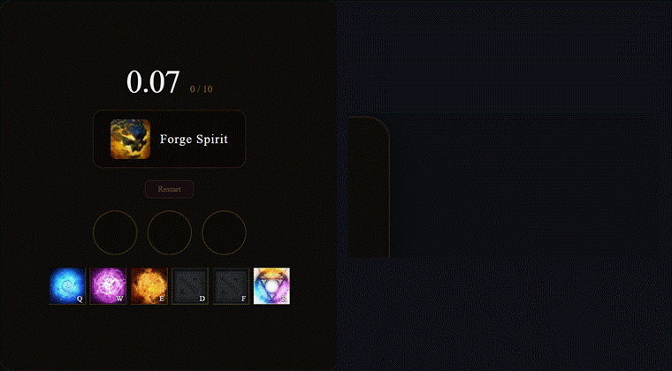
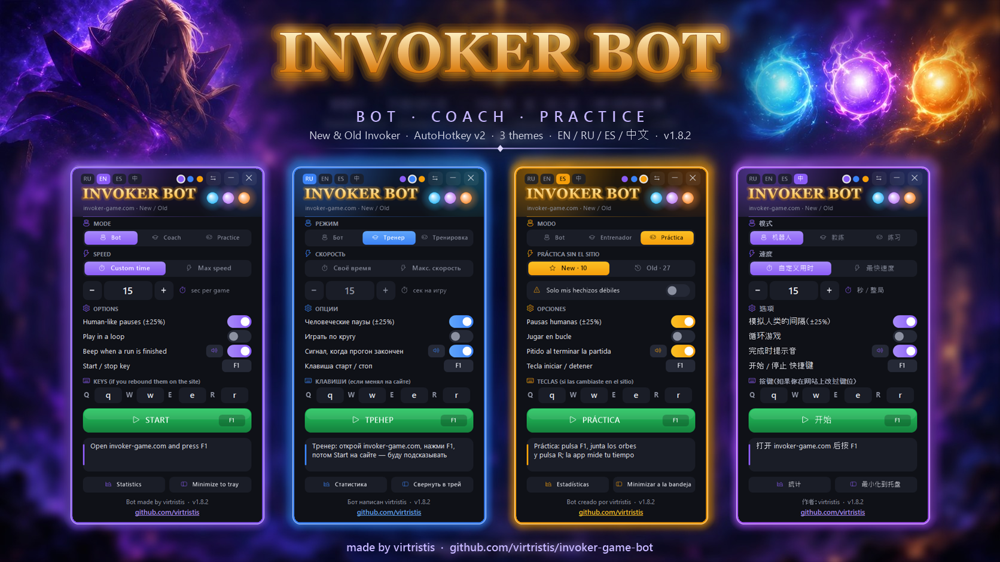
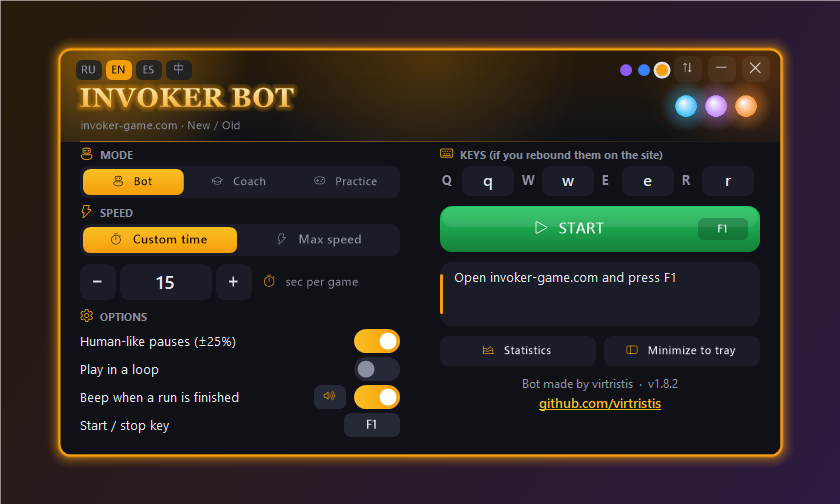
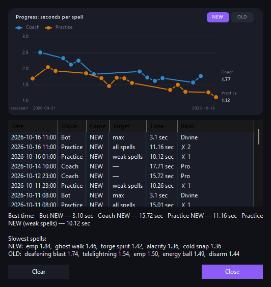
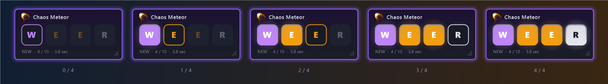
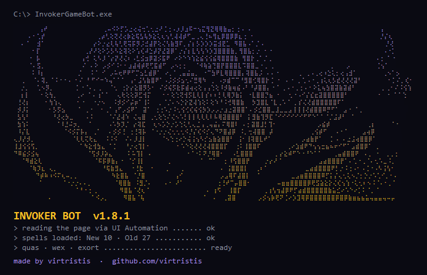
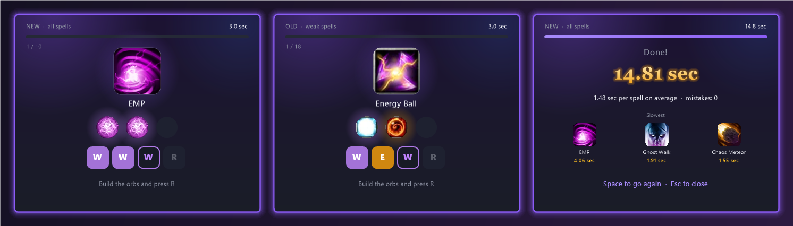

# Invoker Game Bot

**English** · [Русский](README.ru.md) · [Español](README.es.md) · [中文](README.zh.md) · 🌐 [Website](https://virtristis.github.io/invoker-game-bot/)

An AutoHotkey v2 bot and **coach** for the [invoker-game.com](https://invoker-game.com/) trainer. It can play by itself at a speed you control, or stay hands-off and show you the right combo while you play. Supports both **New** (10 spells) and **Old** (27 spells) Invoker.

> [!IMPORTANT]
> **This is an educational project.** It was made to show how desktop automation can read a web page through Windows UI Automation, and to help people learn Invoker combos. It is **not** meant for setting records, climbing leaderboards or passing off bot results as your own skill.
> Please don't use bot mode while signed in to the site's records, and don't submit bot runs. The trainer exists so people can practice Invoker. Respect that and its author.

## Features

- **Bot mode**: plays **New** and **Old** by itself and detects the mode automatically
  - **Time control**: set how many seconds the whole run should take, or pick max speed
  - Optional human-like jitter between key presses, auto-restart
- **Coach mode**: presses nothing. An overlay above the game shows the current spell's combo and highlights the keys you've already pressed. Keys glow in their orb colour (Quas blue, Wex purple, Exort amber), the next key gets a coloured outline, the rest stay grey. In New mode the order doesn't matter, so the hint follows the order you actually press. Great for learning the 27 ordered combos of Old Invoker. Drag the overlay to move it, drag its corner or turn the mouse wheel over it to resize it, right-click to reset.
- **Practice mode (no site needed)**: the app shows a spell with its icon (New or Old), you build the orbs and press R, and it times every spell. **Only my weak spells** drills just the spells your statistics say are slowest.
- **Statistics**: a progress chart (seconds per spell over time), run history, best times, and your slowest spells
- **Tray / compact mode**: hide the window, and a small overlay shows what the bot is doing
- Custom **start/stop hotkey** (F1 by default) and custom key bindings
- A sound and a Windows notification when a run is finished: **pick from 5 built-in sounds, the Windows sound or your own file, with a volume slider** (🔊 button next to the switch)
- **Intro**: on startup a console-style window draws Invoker in braille dots (click or Esc to skip, `intro=0` in `invoker_bot.ini` turns it off)
- Checks for updates on startup and **updates in one click**: click the line in the header, the app downloads the new `.exe`, checks its SHA-256 and restarts
- Dark interface in **English, Русский, Español, 中文**
- **3 colour themes** (violet / blue / gold) and a **vertical or horizontal layout**: switch them with the dots and the ⇆ button in the header. Buttons light up under the mouse and switches slide smoothly
- No browser extensions or bookmarklets needed

Horizontal layout

Statistics and progress chart

Coach overlay

Intro on startup

## 🎓 Coach mode: actually learn Invoker

The bot shows what's possible. **Coach is the part that makes *you* better.** It never presses anything: you play, it watches and helps.

- **Live combo hint.** An overlay above the game shows the current spell and the keys you need, coloured like the orbs: Quas blue, Wex purple, Exort amber. You start linking spells to colours instead of reading text.
- **Instant feedback on every press.** Correct keys light up, the next key gets a coloured outline, wrong presses don't light anything. You see a mistake the moment you make it, not after the run.
- **Plays by the game's rules.** In **New** the orb order doesn't matter, so the hint follows the order you actually press. In **Old** it matters (27 ordered combos), and the coach checks the exact order. It also remembers the orbs you already have, like the game does: if they already fit, it just tells you to press **R**.
- **Finds your weak spots.** Every spell is timed. The **Statistics** window shows your slowest spells, so you know exactly what to drill.
- **Shows your progress.** Every run is saved with the site time and rank, so you can watch yourself get faster.

**How to train with it**
1. Pick **Coach**, press **F1**, open invoker-game.com and press **Start Game**.
2. Play normally and glance at the overlay only when you hesitate.
3. After a few runs, open **Statistics**, find your slowest spells and focus on them.
4. Once the combos are in your fingers, minimize the window to the tray and try not to look at the overlay at all.

## 🎯 Practice mode: train without the site

Practice runs entirely inside the app, so it works offline and between games.

- **Spell icons like in the game.** You see the spell's icon and name, then build the orbs with Q/W/E and invoke with **R**. Wrong spell? It counts a mistake and shows the hint.
- **Hint only when you need it.** The combo appears if you think longer than 2.5 seconds or make a mistake, so you practise remembering, not reading.
- **New or Old.** New runs all 10 spells, Old runs all 27 (the order of orbs matters there), each in random order.
- **Only my weak spells.** The app takes your slowest spells from the statistics (and the ones you've never practised) and drills just those, each one twice.
- Every spell time goes to the same statistics as the coach, so your weak spots update as you improve.

The icons are downloaded once into `%APPDATA%\InvokerGameBot\icons`: New from Valve's Dota 2 CDN, Old from invoker-game.com. They are not part of this repository. Without internet the app draws plain orbs instead.

## How it works

The site ignores synthetic keyboard events from JavaScript, so the bot works from outside the browser:

1. It reads the current spell and progress (`3 / 10`) from the page through **Windows UI Automation**, the accessibility API that screen readers use.
2. It looks up the orb combination, for example *Sun Strike* = `E E E` then `R`.
3. **Bot:** it sends real key presses with AutoHotkey and spaces them out to hit your target time.
   **Coach:** it listens to your Q/W/E presses and highlights how far into the combo you are.

## Download

- **Easiest:** download `InvokerGameBot-vX.Y.Z.exe` from [Releases](https://github.com/virtristis/invoker-game-bot/releases/latest) and run it. You don't need AutoHotkey.
  The `.exe` is built by [GitHub Actions](.github/workflows/release.yml) straight from the source of each release.
- **Or** download `InvokerGameBot-vX.Y.Z-source.zip` (or clone the repo) and run `invoker_bot.ahk` with [AutoHotkey v2](https://www.autohotkey.com/). It needs the `lib` folder next to it.

> [!NOTE]
> The `.exe` is not code-signed, so Windows SmartScreen or an antivirus may warn about it. This is common for compiled AutoHotkey scripts. Compare the SHA-256 checksum from the release notes, or run the `.ahk` source instead.

## Requirements

- Windows 10/11
- A Chromium-based browser (Chrome, Edge, Brave, Opera, Yandex…)
- AutoHotkey v2, only if you run the `.ahk` source

## Usage

1. Run `InvokerGameBot-vX.Y.Z.exe` (or `invoker_bot.ahk`).
2. Open [invoker-game.com](https://invoker-game.com/) and choose **New** or **Old**.
3. Pick a mode:
   - **Bot**: set the time (or **Max speed**), switch to the game tab and press **F1**. The bot clicks Start by itself.
   - **Coach**: press **F1**, switch to the game tab and press **Start Game**. Then follow the overlay.
   - **Practice**: pick New or Old, press **F1** and then **Space** in the practice window. No browser needed.
4. Press **F1** again at any time to stop.

The game tab must stay active while the bot runs. If you switch away, the bot waits until you come back.
Settings and statistics are stored in `%APPDATA%\InvokerGameBot` (`invoker_bot.ini`, `invoker_stats.csv`, `invoker_spells.ini`), so nothing is created next to the program.

## Project structure

- `invoker_bot.ahk`: the entry point, settings and windows in start-up order.
- `lib\`: modules with functions only (`logic.ahk` for the coach and practice logic, plus `ui`, `gdip`, `overlay`, `drill`, `stats`, `sound`, `icons`, `update`, `game`) and data (`spells.ahk`, `strings.ahk`).
- `tests\run_tests.ahk`: automatic tests of the logic. GitHub Actions runs them on every push and before every release build.
- `site\`: the project website on GitHub Pages.
- `tools\`: scripts that build the images in `docs\` from the app's screenshots (`make-banner.ps1`, `make-docs-images.ps1`, `make-social-preview.ps1`).

## Changelog

See [CHANGELOG.md](CHANGELOG.md).

## Disclaimer

Not affiliated with invoker-game.com, its author, or Valve Corporation. Dota 2 and Invoker are trademarks of Valve Corporation. Use at your own risk.

## Author

Made by **[virtristis](https://github.com/virtristis)**. Licensed under the [MIT License](LICENSE).
