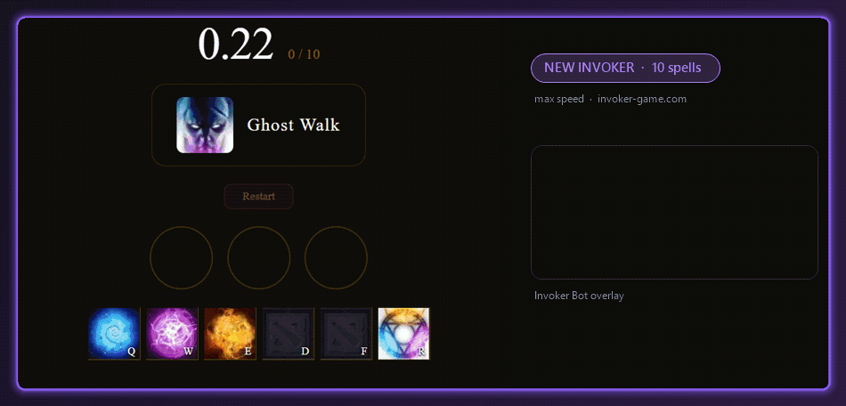
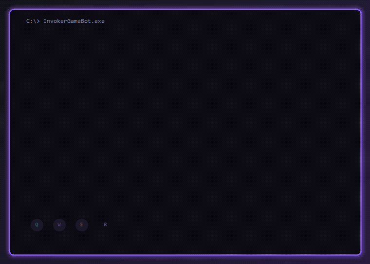
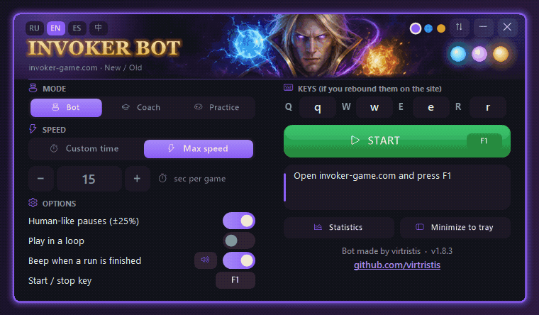
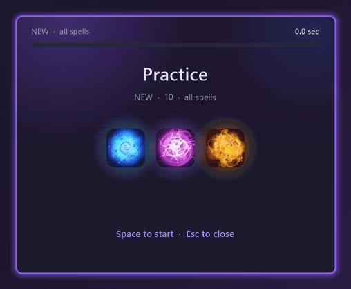

# Invoker Game Bot

[English](README.md) · [Русский](README.ru.md) · [Español](README.es.md) · **中文** · 🌐 [网站](https://virtristis.github.io/invoker-game-bot/)

一个基于 AutoHotkey v2 的 [invoker-game.com](https://invoker-game.com/) 卡尔练习器机器人和**教练**。它可以按照你设定的速度自动完成游戏，也可以不按任何键，只在你自己玩的时候提示正确的组合。支持 **New**（10 个技能）和 **Old**（27 个技能）两种模式。

机器人在 invoker-game.com 上以最快速度运行：先 New，再 Old，右侧为程序的浮窗

## 💡 项目缘起

一开始只是一个机器人。我想看看程序能不能自己通关 [invoker-game.com](https://invoker-game.com/)，于是写了一个读取网页并释放每个技能的机器人。它跑通之后，我意识到更有用的是帮助大家自己学会组合，于是在机器人里做了自己的训练器：会点亮你按键的**教练**浮窗，以及程序内的**练习**模式——带技能图标、计时和进度图表。

> [!IMPORTANT]
> **这是一个学习项目。** 它演示了桌面程序如何通过 Windows UI Automation 读取网页内容，并帮助大家学习卡尔的技能组合。它**不是**用来刷纪录、冲排行榜或把机器人的成绩冒充成自己的水平的。
> 请不要在登录网站纪录账号时使用机器人模式，也不要提交机器人的成绩。这个练习器是为了让大家练习卡尔而存在的，请尊重它和它的作者。

## 功能

- **机器人模式**：自动完成 **New** 和 **Old**，自动识别模式
  - **时间控制**：设定整局用时（秒），或选择最快速度
  - 可选的模拟人类按键间隔、自动重开
- **教练模式**：不按任何键。游戏上方的浮窗显示当前技能的组合，并高亮你已经按下的键。按键以对应元素的颜色发光（Quas 蓝、Wex 紫、Exort 黄），下一个键带彩色边框，其余为灰色。New 模式中顺序无关，提示会跟随你实际按键的顺序。非常适合记住 Old 模式中 27 个有顺序的组合。浮窗可以用鼠标拖动，拖动右下角或在上面滚动鼠标滚轮可调整大小，右键可重置。
- **离线练习**：程序自己出题，显示技能图标（New 或 Old），你切好元素球再按 R，程序为每个技能计时。**只练我的弱项技能**会根据统计只练你最慢的技能。
- **统计**：进步图表（每个技能的秒数随时间的变化）、历史记录、最佳成绩以及你最慢的技能
- **托盘 / 紧凑模式**：隐藏主窗口，只用一个小浮窗显示机器人的操作
- 自定义**开始/停止快捷键**（默认 F1）和 Q/W/E/R 按键
- 完成时的提示音和 Windows 通知：**5 种内置声音、Windows 提示音或自定义文件，并可调节音量**（开关旁的 🔊 按钮）
- **开场动画**：启动时在控制台风格的窗口中用盲文点阵画出卡尔，依次点亮 Quas · Wex · Exort 并施放 **INVOKE!**，然后收拢成主窗口（点击或按 Esc 跳过，在 `invoker_bot.ini` 中设置 `intro=0` 可关闭）
- **退出时的天火（Sun Strike）**：关闭窗口时一道天火落在窗口上：金色瞄准圈、光柱、火花，窗口随之燃尽
- 启动时检查更新，**一键更新**：点击标题栏中的提示，程序会下载新的 `.exe`、校验 SHA-256 并自动重启
- 深色界面，支持 **English、Русский、Español、中文**
- **3 种配色主题**（紫 / 蓝 / 金）以及**竖向或横向布局**：用标题栏中的圆点和 ⇆ 按钮切换。鼠标悬停时按钮会高亮，开关带有平滑动画
- 无需浏览器扩展或书签脚本

统计与进步图表

横向布局

教练浮窗

## ✨ 启动与退出

<table>
<tr>
<td align="center" width="50%"> 启动：盲文点阵肖像，Quas · Wex · Exort，INVOKE!</td>
<td align="center" width="50%"> 退出：天火（Sun Strike）烧掉窗口</td>
</tr>
</table>

## 🎓 教练模式：真正学会卡尔

机器人展示了可能达到的速度，**而教练模式才是真正让*你*变强的部分。**它不会按任何键：你来玩，它在旁边观察并提示。

- **实时组合提示。**游戏上方的浮窗显示当前技能和需要按的键，并用元素的颜色标出：Quas 蓝、Wex 紫、Exort 黄。你会逐渐把技能和颜色联系起来，而不是去读文字。
- **每次按键即时反馈。**按对的键会亮起，下一个键带彩色边框，按错则不会亮。错误当场就能看到，而不是等到结束。
- **遵循游戏规则。**在 **New** 中元素顺序无关，提示会跟随你的按键顺序；在 **Old** 中顺序很重要（27 个有序组合），教练会检查准确的顺序。它还会像游戏一样记住你当前已有的元素：如果已经正确，就直接提示按 **R**。
- **找出薄弱环节。**每个技能都会计时，**统计**窗口会列出你最慢的技能，让你知道该练什么。
- **记录进步。**每局都会保存网站计时和段位，你能看到自己越来越快。

**训练方法**
1. 选择**教练**，按 **F1**，打开 invoker-game.com 并点击 **Start Game**。
2. 正常游戏，只有犹豫时才看一眼浮窗。
3. 玩几局后打开**统计**，找出最慢的技能并重点练习。
4. 组合熟练后，把窗口最小化到托盘，尝试完全不看浮窗。

## 🎯 练习模式：不需要网站

一次完整练习：New 的 10 个技能，停顿后出现提示，一次按错，最后是成绩

截图：New、Old 和成绩

练习完全在程序内进行，不联网、两局游戏之间都能练。

- **和游戏一样的技能图标。**看到技能图标和名称后，用 Q/W/E 切好元素球，再按 **R** 释放。技能不对会记一次失误并显示提示。
- **需要时才提示。**思考超过 2.5 秒或出错时才显示组合，练的是记忆而不是阅读。
- **New 或 Old。**New 练全部 10 个技能，Old 练全部 27 个（元素顺序很重要），顺序随机。
- **只练我的弱项技能。**程序从统计中挑出你最慢的技能（以及还没练过的），每个练两遍。
- 每个技能的用时都会记入和教练模式相同的统计，弱项会随着你的进步而更新。

图标只下载一次，保存在 `%APPDATA%\InvokerGameBot\icons`：New 来自 Valve 的 Dota 2 CDN，Old 来自 invoker-game.com，不包含在本仓库中。没有网络时程序会改为绘制简单的元素球。

## 工作原理

网站会忽略 JavaScript 生成的模拟键盘事件，所以机器人从浏览器外部工作：

1. 通过 **Windows UI Automation**（读屏软件使用的无障碍接口）读取当前技能和进度（`3 / 10`）。
2. 查找对应的元素组合，例如 *Sun Strike* = `E E E`，然后按 `R`。
3. **机器人**用 AutoHotkey 发送真实按键，并调整间隔以达到目标用时。
   **教练**监听你按下的 Q/W/E，并高亮你已经完成的部分。

## 下载

- **最简单：**从 [Releases](https://github.com/virtristis/invoker-game-bot/releases/latest) 下载 `InvokerGameBot-vX.Y.Z.exe` 直接运行，无需安装 AutoHotkey。
  `.exe` 由 [GitHub Actions](.github/workflows/release.yml) 直接从每个版本的源码编译。
- **或者**下载 `InvokerGameBot-vX.Y.Z-source.zip`（或克隆仓库），用 [AutoHotkey v2](https://www.autohotkey.com/) 运行 `invoker_bot.ahk`，旁边需要有 `lib` 文件夹。

> [!NOTE]
> `.exe` 没有数字签名，Windows SmartScreen 或杀毒软件可能会发出警告，这在编译后的 AutoHotkey 脚本中很常见。可以核对发布说明中的 SHA-256 校验值，或直接使用 `.ahk` 源码。

## 运行要求

- Windows 10/11
- Chromium 内核浏览器（Chrome、Edge、Brave、Opera 等）
- AutoHotkey v2（仅在运行 `.ahk` 源码时需要）

## 使用方法

1. 运行 `InvokerGameBot-vX.Y.Z.exe`（或 `invoker_bot.ahk`）。
2. 打开 [invoker-game.com](https://invoker-game.com/)，选择 **New** 或 **Old**。
3. 选择模式：
   - **机器人**：设置用时（或选择 **最快速度**），切换到游戏标签页，按 **F1**。机器人会自己点 Start。
   - **教练**：按 **F1**，切换到游戏标签页，点 **Start Game**，然后按浮窗提示操作。
   - **练习**：选择 New 或 Old，按 **F1**，然后在练习窗口中按 **空格**。不需要浏览器。
4. 再次按 **F1** 即可停止。

机器人运行时游戏标签页必须保持在前台；切换走后，机器人会等待你回来。
设置和统计保存在 `%APPDATA%\InvokerGameBot`（`invoker_bot.ini`、`invoker_stats.csv`、`invoker_spells.ini`），不会在程序旁边生成任何文件。

## 更新日志

见 [CHANGELOG.md](CHANGELOG.md)。

## 免责声明

本项目与 invoker-game.com、其作者以及 Valve Corporation 无关。Dota 2 和 Invoker 是 Valve Corporation 的商标。使用风险自负。

## 作者

由 **[virtristis](https://github.com/virtristis)** 制作，采用 [MIT 许可证](LICENSE)。
